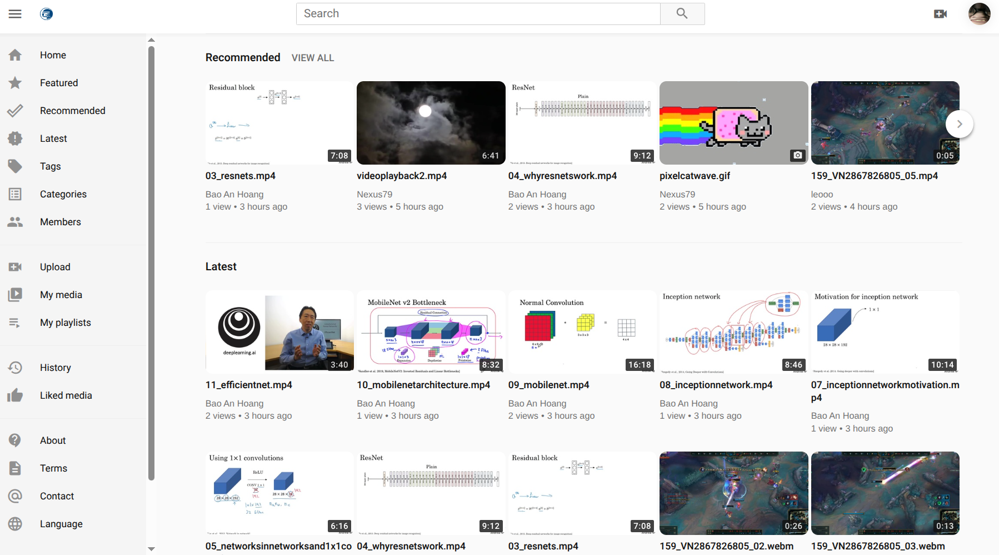
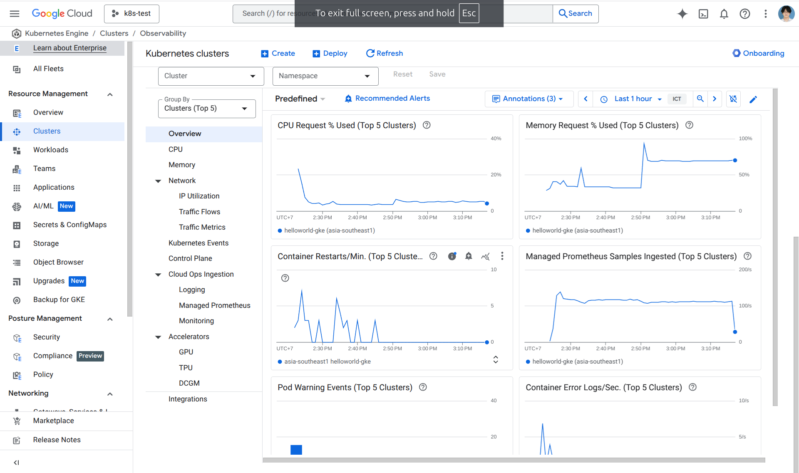
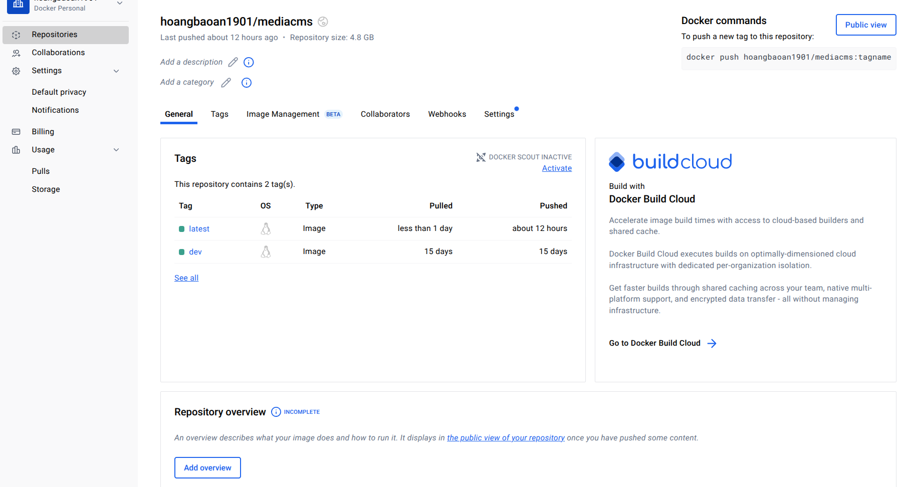
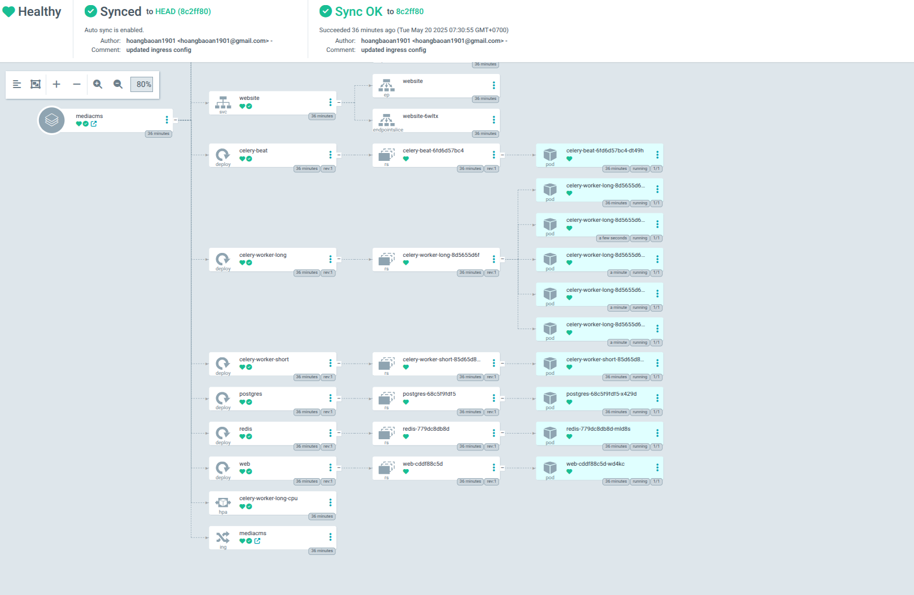
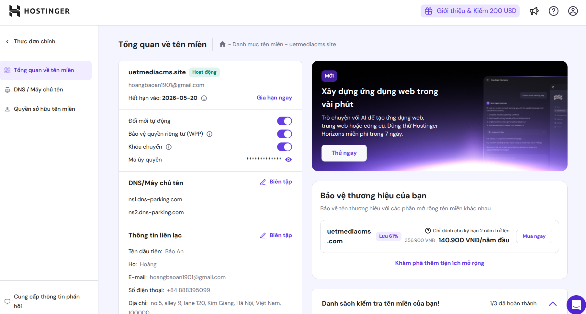

# Deploying MediaCMS on Kubernetes

>MediaCMS is a modern, fully featured open source video and media CMS. It is developed to meet the needs of modern web platforms for viewing and sharing media. It can be used to build a small to medium video and media portal within minutes.




From the original repository [here](https://github.com/mediacms-io/mediacms), we decided to deploy the apps on Google Kubernetes Engine as well as automating the process of CI/CD with Github Actions and ArgoCD. In this document, we will go through the set up process to deploy this application on GKE.

## 1. Setup Google Kubernete Engine (GKE)

There're many options to create a GKE cluster. Here we used a Standard Cluster with 3 nodes. Each instances has 8 CPUs, 8GB of RAM, and 64GB of Persistent Disk. We didn't use Auto Pilot since the Compute Engine Persisten Disk quota limitation: transcoding videos creates a high workloads on CPUs; however, Autopilot doesn't have a configuration (or we didn't saw it) on giving each node a certain amount of CPU at initial state, so when there're high workload on CPU, Auto Pilot keep spawning a new node - adding 100GB of Persistant Disk to our quota.

### 1.1 (!!! Important) Google Cloud FileStore setup
Since Compute Engine doesn't support `ReadWriteMany` access mode on the Volume (https://cloud.google.com/kubernetes-engine/docs/concepts/persistent-volumes#access_modes), we'll have to use Google Cloud FileStore to give our StatefulSets deployment Persistent Volumes (PV) with `ReadWriteMany` support.

On our set up, we've enabled GKE Filestore CSI driver to provision our Storage Class, PV and PVC.

Setup docs can be found at (https://cloud.google.com/filestore/docs/filestore-for-gke)




## 2. Setting up Github Action Build Automation
First, to automate the processing of building Docker Image for the application, we'd first have to create a new personal acess token for our account. Generating a new token can be done at https://app.docker.com/settings/personal-access-tokens

Then, on our Github repository, we'll have to add the secrets on our Action Secret: `DOCKER_USERNAME` and `DOCKER_PASSWORD`, namely, your docker account's user name and the access token you just created.

The workflow can be read at the Action section. To parse the secrets we just created to push our image on Docker Hub, simply run a login job:
```yaml
      - name: Login to Docker Hub
        uses: docker/login-action@v2.2.0
        with:
          username: ${{ secrets.DOCKER_USERNAME }}
          password: ${{ secrets.DOCKER_PASSWORD }}
```


## 3. Continuous Deployment with ArgoCD
Logging in on our GKE console, we can now install ArgoCD on our cluster now. The `kubectl` tool is already installed for our console.

```sh
kubectl create namespace argocd
kubectl apply -n argocd -f https://raw.githubusercontent.com/argoproj/argo-cd/stable/manifests/install.yaml
```

After that, we set up our manifests for our GKE deployments. Since ArgoCD support plain directory of yaml manifests (https://argo-cd.readthedocs.io/en/stable/#how-it-works), we set up the manifest directory [mediacms-k8s-ha](https://github.com/hoangbaoan1901/mediacms/tree/main/mediacms-k8s-ha)

After that, we deploy our app with ArgoCD Application CRD:

```yaml
apiVersion: argoproj.io/v1alpha1
kind: Application
metadata:
  name: mediacms
  namespace: argocd
spec:
  project: default
  source:
    repoURL: https://github.com/hoangbaoan1901/mediacms.git
    targetRevision: HEAD
    path: mediacms-k8s-ha
  destination:
    server: https://kubernetes.default.svc
    namespace: mediacms
  syncPolicy:
    automated:
      prune: true
      selfHeal: true
    syncOptions:
      - CreateNamespace=true
```



## 4. Load Balancer & Setting up DNS
After our deployments has been set up, our next step is to expose our application to the outside Internet. Luckily, GKE support LoadBalancer services, and we'd have to set it up for our `default` VPC network (https://cloud.google.com/kubernetes-engine/docs/concepts/service-load-balancer). One might just use the `LoadBalancer` service type already available on GKE for this step, the important part is to obtain the **External IP** for your service.


Once the **External IP** has been obtained, we'd have to create an A record for our domain name. Here, we used Hostinger to set up our domain name server.




Our website can be found at http://uetmediacms.site/

## Difficulties and Issues
- Both `django-saml2-auth` and `django-celery-email` are now deprecated, so now we're having trouble setting up Single Sign On and Account verification.
- We haven't figured out deploying TLS keys on our domain name yet.

